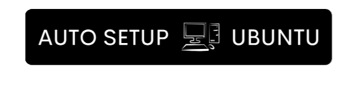

<center>

<p style="font-weight: bold; max-width: 75%; font-size: 16px; text-align: center;">Script para automatizar a configuração de um servidor x86/ARM com Docker, proxy reverso (Caddy) + atualização dinâmica de DNS free (DuckDNS).
Assim como configuração em Docker Swarm se necessário.</p>
</center>

## Funcionalidades Principais

1. **Configuração Automática de Swap**  
   Cria uma partição swap de 20% do disco (máx. 2GB).

2. **Instalação de Docker + Docker Compose**
   Versões mais recentes configuradas para usuário não-root.
   
3. **Docker Swarm**  
   - Configuração da VM como um Manager ou Worker com Docker Swarm (opcional)

4. **Proxy Reverso com HTTPS Automático**  
   Usando Caddy com:  
   - Certificado Let's Encrypt  
   - Domínio DuckDNS (ex: `apps.seudominio.duckdns.org`)  
   - Suporte a múltiplos subdomínios automaticamente  

5. **Segurança Básica**  
   - Firewall (UFW) com portas 22/80/443 liberadas  
   - Failsafe de reinicialização do SSH (caso tenha algum problema)

6. **Atualização Dinâmica de DNS**  
   - Atualizações a cada 15 minutos (apenas das 6h às 23h)  

7. **Estrutura para Novos Apps**
   - Diretório `~/apps` para todos os serviços

## Pré-requisitos

- Conta no [DuckDNS](https://www.duckdns.org) com:  
  - Subdomínio registrado
  - Token de acesso
- Acesso SSH à instância

## Como Usar

1. **Executar o Script**:  
```bash
# Modo Standalone (default)
curl -sSL https://raw.githubusercontent.com/Fconstant/auto-setup-ubuntu-vm/main/setup-server.sh | bash

# Modo Manager (Docker Swarm)
curl -sSL ... | SWARM_MODE=manager bash

# Modo Worker (Docker Swarm)
curl -sSL ... | SWARM_MODE=worker bash

```

2. **Configurar Variáveis**:  
```bash
mv ~/.env.example ~/.env && nano ~/.env
```

3. **Reiniciar Sessão SSH**:  
```bash
exit # Depois, reconecte na VM
```

## Auto-Configuração

| Recurso             | Detalhes                          |
|---------------------|-----------------------------------|
| Novo App Docker     | Basta usar a rede `caddy-net`     |
| Certificado SSL     | Gerado automaticamente no 1º acesso |
| Subdomínios         | Padrão: `app.dominio.duckdns.org` |

## Segurança

- **Portas Bloqueadas**: Todas exceto 22(SSH), 80(HTTP), 443(HTTPS)  
- **SSH Failsafe**: Reinício automático se não responder  

## Troubleshooting

Problema Comum               | Solução  
----------------------------|---------  
"Permission denied" Docker  | Execute `newgrp docker`  
Certificado não gerado      | Verifique `.env` e reinicie Caddy  
Domínio não resolve         | Confira logs com `journalctl -u duckdns`  

> **Nota**: Para adicionar novos serviços, crie um novo diretório em `~/apps` e use `docker compose` com a rede `caddy-net`.